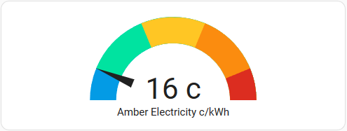
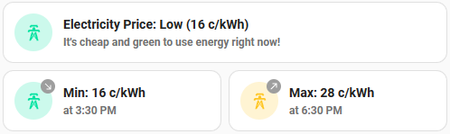

# Home Assistant Config

[Home Assistant](https://www.home-assistant.io/) is an open source home automation that puts local control and privacy first. There are thousands of official and community supported integrations with a broad range of IoT devices.

## Source Config 

This is an experimental project for Home Assistant automation using the official Home Assistant Core (docker) image with MySQL Maria DB and Mosquitto MQTT broker.

## Integrations

### Amber Electric

My custom [Amber Electric](integrations/amber_electric/README.md) integration displays electricity price forecasts for the next four hours. Even if you are not a customer with Amber Electric, the templates may provide some guidelines for you to customize to your energy provider.




## Getting Started

[](https://vscode.dev/redirect?url=vscode://ms-vscode-remote.remote-containers/cloneInVolume?url=https://github.com/mikejonestechno/home-assistant-config)

> If you already have VS Code and Docker installed, you can click the badge above to get started. Clicking this link will cause VS Code to automatically install the Dev Containers extension if needed, clone the source code into a container volume, and spin up a dev container for use.

1. Initially Home Assistant may activate 'safe mode' because the `secrets.yaml` is not defined in the github source project.

    ``` log
    ERROR (MainThread) [homeassistant.bootstrap] Failed to parse configuration.yaml:
    Secret home_latitude not defined. Activating safe mode
    ```

    The `init.sh` will create an example `secrets.yaml` file for you. Modify the properties in `secrets.yaml` to match your home location and timezone.

2. Open http://localhost:8123/ in a browser and start the onboarding setup to initialize your admin user account.

    The initial onboarding will prompt you for home location (default Amsterdam). The onboarding does not use the default configuration and `secrets.yaml` properties so skip the rest of the onboarding wizzard, supply a dummy fake address, and accept all the defaults for country, timezone and currency. 

4. Go to http://localhost:8123/developer-tools/yaml and restart Home Assistant to load the local configuration and `secrets.yaml`.