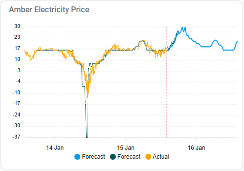

# Amber Electric Integration

Disclaimer: I am a customer of Amber Electric, an Australian electricity provider that offers home users
the wholesale national grid price (changes every 5 min) rather than 24/7 fixed plan rates (eg 32c/kWh).

Even though I dont have solar or battery, Amber Electric enable me to shift my load to off peak periods and save money. I have a referral code for friends and family, no other financial incentive or promotions.

Even if you are not a customer with Amber Electric, the templates may provide some guidelines for you to customize to your energy provider.

## Features

My integration adds custom sensors for min and max prices, with price band color and descriptions so that I can make dashboards themed like the official Amber app.

### Gauge card


### Forecast cards

It's good to know the current price, but will it get cheaper of more expensive later today? I use the 'mushroom template' card from HACS with my custom sensors to display the forecast min and max price over the next four hours.


### Apex Chart

I use the advanced Apex Chart integration from HACS to plot actual historical and forecast prices. This helps me plan ahead and understand how likely the forecast prices will actually be based on historical trends.



## Installation

Install the official Amber Electric integration using the Settings UI.

Name the integration 'amber' so that entities are named sensor.amber_general_price, sensor.amber_general_forecast

My `amber_electric.yaml` will add custom template sensors since the official sensors are in $/kWh to be compatible 
with the Energy dashboard cost estimates, but I prefer cents per kWh for normal dashboard cards and automations.


The official app modified the traffic light colors to reflect national energy price hikes in 2023, however I set 
my own rate thresholds because I beleive anything over 26 cents / kWh should be considered normal, over 36 cents is high.


### Gauge Card

I use the 'gauge' card to show the current electricity price. 


``` yaml
type: gauge
entity: sensor.amber_forecast_price
segments:
  - from: -100
    color: paleblue
  - from: 16
    color: '#00e3a0'
  - from: 26
    color: '#ffc624'
  - from: 36
    color: '#fb8c0f'
  - from: 46
    color: '#dc2d20'
  - from: 70
    color: '#c920dc'
max: 51
unit: c
name: Amber Electricity c/kWh
needle: true
min: 11
```

### Forecast cards

I use the 'mushroom template' card from HACS that enables me to display conditional states and properties from my custom Amber sensors.


``` yaml
type: custom:mushroom-template-card
primary: >-
  Electricity Price: {{ state_attr('sensor.amber_current_price','label') }} ({{
  states('sensor.amber_current_price', with_unit=true) }})
secondary: '{{ state_attr(''sensor.amber_current_price'', ''description'') }}'
icon: '{{ state_attr(''sensor.amber_current_price'',''icon'') }}'
entity: sensor.amber_forecast_price
icon_color: '{{ state_attr(''sensor.amber_current_price'',''color'') }}'
tap_action:
  action: none
hold_action:
  action: none
double_tap_action:
  action: none
fill_container: false
multiline_secondary: true
```

Minimum price (next four hours)

``` yaml
type: custom:mushroom-template-card
primary: 'Min: {{ states(''sensor.amber_4hr_min'') }}  c/kWh'
secondary: >
  at {{ as_timestamp(state_attr('sensor.amber_4hr_min', 'time')) |
  timestamp_custom("%-I:%M %p") }} 
icon: mdi:transmission-tower
entity: sensor.amber_4hr_min
icon_color: '{{ state_attr(''sensor.amber_4hr_min'', ''color'') }} '
multiline_secondary: true
tap_action:
  action: none
hold_action:
  action: none
double_tap_action:
  action: none
badge_icon: mdi:arrow-bottom-right
```

Maximum price (next four hours)

```yaml
type: custom:mushroom-template-card
primary: 'Max: {{ states(''sensor.amber_4hr_max'') }}  c/kWh'
secondary: >-
  at {{ as_timestamp(state_attr('sensor.amber_4hr_max', 'time')) |
  timestamp_custom("%-I:%M %p") }} 
icon: mdi:transmission-tower
entity: sensor.amber_forecast_4_hr_max
icon_color: '{{ state_attr(''sensor.amber_4hr_max'', ''color'') }} '
multiline_secondary: true
tap_action:
  action: none
hold_action:
  action: none
double_tap_action:
  action: none
badge_icon: mdi:arrow-top-right
```

### Apex Chart

I use the advanced Apex Chart integration from HACS to plot actual historical and forecast prices. 


``` yaml
type: custom:apexcharts-card
header:
  show: true
  title: Amber Electricity Price
  show_states: true
  colorize_states: true
all_series_config:
  stroke_width: 1
  unit: c/kWh
  show:
    legend_value: false
    in_header: false
update_interval: 5min
graph_span: 3d
span:
  offset: +1d
yaxis:
  - decimals: 0
now:
  show: true
  color: red
series:
  - entity: sensor.amber_general_forecast
    name: Forecast
    color: '#039be5'
    stroke_width: 2
    data_generator: |
      return entity.attributes.forecasts.map((entry) => {
        return [new Date(entry.start_time), entry.per_kwh * 100];
      });
  - entity: sensor.amber_forecast_price
    name: Forecast
    extend_to: now
    time_delta: +4h
    attribute: amber_4hr_price
    transform: return x * 100
    color: '#005555'
  - entity: sensor.amber_general_price
    name: Actual
    transform: return x * 100
    extend_to: now
    color: '#ffa500'
```
